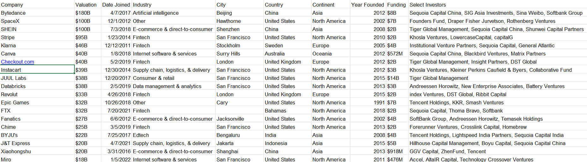
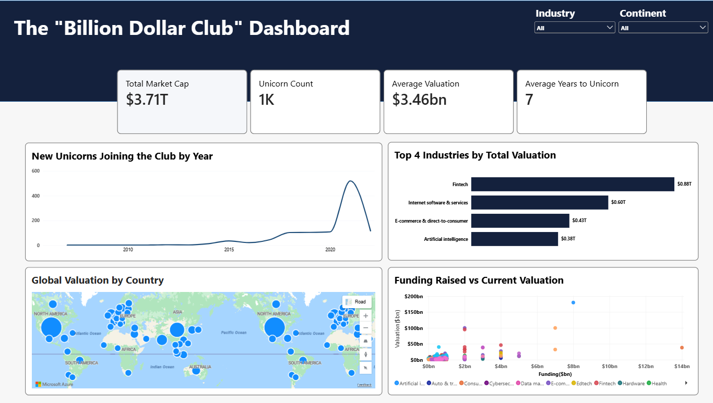

# The “Billion Dollar Club” – Global Unicorn Companies Analysis

## Executive Summary
The analysis focuses on better understanding the growth of these companies, the industries attracting the most investment, the countries with the highest valuations, and how funding raised compares with their current valuation. The purpose of this analysis is to help investors and venture capital firms better understand market trends and identify potential investment opportunities.

## Business Context
Unicorn companies have become an important part of the global market and investment ecosystem. The insights from this analysis are intended to help stakeholders understand where these companies are located and which industries they operate in. This provides a clearer view of the global unicorn market and highlights areas with strong growth and investment potential.

## Objectives
The main objectives of this analysis are to:
- Analyze the growth of unicorn companies over the years.
- Identify the industries with the highest total valuation.
- Compare funding raised with current company valuation to identify potentially capital-efficient   companies.
- Analyze the average number of years companies take to become unicorns.
- Provide interactive insights using Industry and Continent filters.

## Data Overview
The global unicorn companies dataset contains 1,075 rows and 11 columns. It includes information such as company name, industry, country, continent, valuation, funding raised, and the year the company became a unicorn. The dataset was analyzed using Power BI to create an interactive dashboard that presents the key findings in an easy-to-understand format.

## Data Preview

## Key Findings
- The Total Market Cap was $3.71T.
- The analysis shows the growth of unicorn companies over different years.
- The Fintech industry contributed the highest total valuation.
- The United States has become a major hub for unicorn companies.
- The analysis shows the relationship between funding raised and current valuation.
- The analysis also shows how long companies take to reach unicorn status.

## Dashboard

## Link to Power BI Report
Click the link to access the full Power BI Report: <a href=" [Click here]( https://tinyurl.com/4pfum74e
)

## Data Cleaning and transformation
- Created a calculated column to determine the number of years taken for companies to reach unicorn status.
- Removed duplicate entries from the dataset.
- The dataset was checked for missing values, incorrect formats, and inconsistencies before visualization.

## Detailed Findings & Analysis
### Key Performance Indicators
- Total Market Cap exceeded $3.71T during the review period. 
- The Average Valuation was $3.46B. 
- It took an average of 7 years for companies to reach unicorn status. 
- The analysis of new unicorns by year shows how the number of companies reaching unicorn status has changed over time. This helps identify periods of strong startup growth as well as periods when unicorn creation slowed down.

### Industry Analysis
- The top industries were analyzed based on their total company valuation.
- The four industries with the highest total valuations were Fintech, Internet Software & Services, E-commerce & Direct-to-Consumer, and Artificial Intelligence.
- The Fintech sector recorded the highest total valuation at approximately $0.88T, highlighting it as an industry with significant investment activity.

### Geographic Analysis
- The map visual shows the distribution of unicorn valuations across different countries.
- This helps identify countries such as the United States that have become important hubs for high-value startups.
- North America recorded the highest market cap at $2.03T, followed by Asia at $1.07T, while Africa recorded the lowest at approximately $5.0B.

### Funding vs Valuation
- The comparison between funding raised and current valuation helps show how companies have grown in value relative to the capital invested in them.
- Companies with strong valuations compared with their funding may indicate greater capital efficiency.
- JULL Labs recorded $14B in funding and a current valuation of $38B. This comparison helps demonstrate how the company’s valuation relates to the capital invested in it.

### Average Years to Unicorn Status
- It took an average seven (7) years for companies to reach unicorn status
- This analysis provides insight into how quickly startups are achieving billion-dollar valuations.

## Recommendations
- Investors should pay more attention to industries such as Fintech, which have consistently high total valuations.
- Countries and Industries with strong unicorn activity should be considered important markets for future investment opportunities
- Companies that recorded high valuations with relatively lower funding should be monitored because of their potential capital efficiency.

## Tools Used
- **Power Query**: Data cleaning and transformation
- **Power BI**: Data analysis and visualization

## Conclusion
The Billion Dollar Club analysis shows strong growth in the global unicorn market, with Fintech making a major contribution to total valuation and North America remaining the leading region. The analysis also highlights the relationship between funding and company valuation, as well as the average time taken to reach unicorn status. Focusing on high-performing industries and regions can help investors identify better opportunities and make informed investment decisions.

